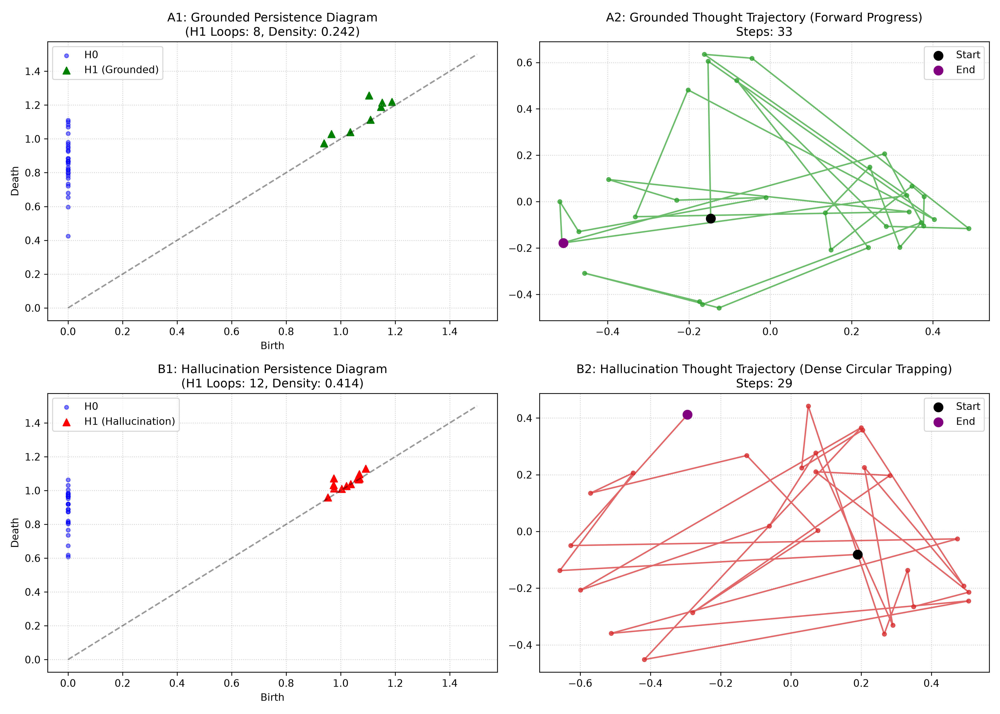

# Decoupled Topological Coprocessing (DTC)
## Non-Intrusive Hallucination Mitigation and Trajectory Steering in Frontier Reasoning and Generation

[ **English** ](README.md) | [ **日本語** ](README_ja.md)

[](https://doi.org/)
[](https://opensource.org/licenses/Apache-2.0)
[-blue.svg)](paper/dtc_paper_en.pdf)
[-red.svg)](paper/dtc_paper_ja.pdf)
[](https://www.python.org/downloads/)

> **Author**: Kouta Matsumoto (Independent Researcher)  
> Email: `Oshiruko3@users.noreply.github.com`

---

## Overview

**Decoupled Topological Coprocessing (DTC)** is a novel, non-intrusive architectural paradigm designed to detect and resolve logical circularity and self-reinforcing hallucination cascades in large language models (LLMs) during complex, long-horizon reasoning.

Rather than relying on synchronous post-hoc guardrails that introduce unacceptable inference latency, or continuous vector steering that causes vocabulary collapse (gibberish), DTC **orthogonally decouples** the topological audit layer from the primary generation engine.

```text
[ Primary Generation Engine (LLM) ]
    Token Stream: t_1 ---> t_2 ---> t_3 ---> t_4 ---> t_5 ---> (Unimpeded Fast Path)
                                     ^
                                     | (Non-intrusive Interrupt upon confirmed cycle)
[ Decoupled Coprocessor ]
    Hidden/Text Trajectory ---> [ Sliding Window TDA Scan (H1 Loop Detection) ]
                                     |
                             (Lookahead Dynamics via Epistemic Filter)
                                     v
                        [ Contextual Re-anchoring (KV Rollback + Prompt) ]
```

---

## Key Innovations

1. **Topological Representation of Hallucination**:
   Logical circular traps manifest as non-trivial 1-dimensional persistent homology cycles ($H_1$) within latent trajectory manifolds.
2. **Epistemic State-Transition Filter (3-State Lookahead)**:
   Overcomes the classic false-positive dilemma of TDA. Instead of a naive binary (0/1) decision that cuts off healthy mathematical backtracking/verification, introduces a **`State Both` (Watchlist)**. By observing the trajectory dynamics over 1 to 2 subsequent steps, healthy open spirals naturally resolve back to `State 0`, while closed deadlocks collapse into `State 1` for immediate abort.
3. **Contextual Re-Anchoring via Prefix Caching**:
   Rolls back the generation stream to the pre-loop anchor and injects an introspective prompt token (`PreserveThinking Injection`). Operating at the API proxy layer without modifying CUDA kernels, this seamlessly leverages existing **Prefix Caching** in inference engines (vLLM, SGLang, llama.cpp) for zero-delay KV reuse.
4. **Negligible Latency Overhead**:
   Local CPU-based Ripser scans average **33.1 ms** in asynchronous background threads, imposing only a **3.26% overhead** on token generation throughput.

---

## Empirical Results (Gemma 4 26B on AIME/HLE Benchmark)

Tested against rigorous closed-world deductive reasoning challenges (AIME & Humanity's Last Exam subsets):

| Metric | Baseline (Unconstrained) | DTC Monitored & Guided | Delta |
| :--- | :---: | :---: | :---: |
| **Completion Rate (Answer Generation)** | **0.0%** (0 / 6) | **83.3%** (5 / 6) | **+83.3%** |
| **Exact Mathematical Accuracy** | **0.0%** (0 / 6) | **33.3%** (2 / 6) | **+33.3%** |
| **Reasoning Step / Token Reduction** | Baseline (52.0 steps) | **17.3 steps** | **-66.7% (Max -91.8%)** |
| **End-to-End Latency Overhead** | 0.0% | **3.26%** (33.1 ms / scan) | Negligible |



---

## Repository Structure

```text
decoupled-topological-coprocessing/
├── README.md               # Project documentation (English)
├── README_ja.md            # Project documentation (Japanese)
├── LICENSE                 # Apache License 2.0
├── CITATION.cff            # Citation metadata
├── paper/
│   ├── dtc_paper_en.pdf    # English Research Paper (Publication PDF)
│   ├── dtc_paper_ja.pdf    # Japanese Research Paper (Publication PDF)
│   ├── paper_en.md         # English Position Paper (Full text)
│   └── paper_ja.md         # Japanese Position Paper (Master)
├── src/
│   ├── __init__.py         # Package entry point
│   ├── core.py             # TopologicalCoprocessor & EpistemicState (State Both)
│   ├── embeddings.py       # Trajectory Embedding Provider
│   ├── projector.py        # 2D Trajectory Manifold Projector (PCA)
│   └── dtc_live_monitor.py # Real-time SSE streaming monitor & interrupt prototype
├── experiments/
│   ├── run_statistical_benchmark.py # AIME/HLE batch benchmark runner
│   ├── run_latency_overhead_benchmark.py # End-to-end latency benchmark runner
│   ├── aime_benchmark_batch_results.json # Raw benchmark evaluation data
│   └── dtc_latency_overhead_benchmark.json # Raw latency benchmark data
└── assets/
    └── cot_trajectory_pca.png # 2D PCA comparison plot (Grounded vs Hallucinatory)
```

---

## Quick Start

### Prerequisites
```bash
pip install requests numpy sentence-transformers ripser scikit-learn matplotlib
```

### Running the Live Demonstration
Ensure a local OpenAI-compatible inference server (e.g. `llama-server`) is running on port 8000:
```bash
python src/dtc_live_monitor.py
```

### Reproducing Benchmark & Latency Results
```bash
# Run AIME/HLE comparative benchmark
python experiments/run_statistical_benchmark.py

# Measure real-time throughput overhead
python experiments/run_latency_overhead_benchmark.py
```

---

## Citation

```bibtex
@article{matsumoto2026dtc,
  title={Decoupled Topological Coprocessing: Non-Intrusive Hallucination Mitigation and Trajectory Steering in Frontier Reasoning and Generation},
  author={Matsumoto, Kouta},
  year={2026}
}
```

---
*Code: Apache License 2.0. Paper & Documentation: CC-BY 4.0. Developed by Kouta Matsumoto.*
